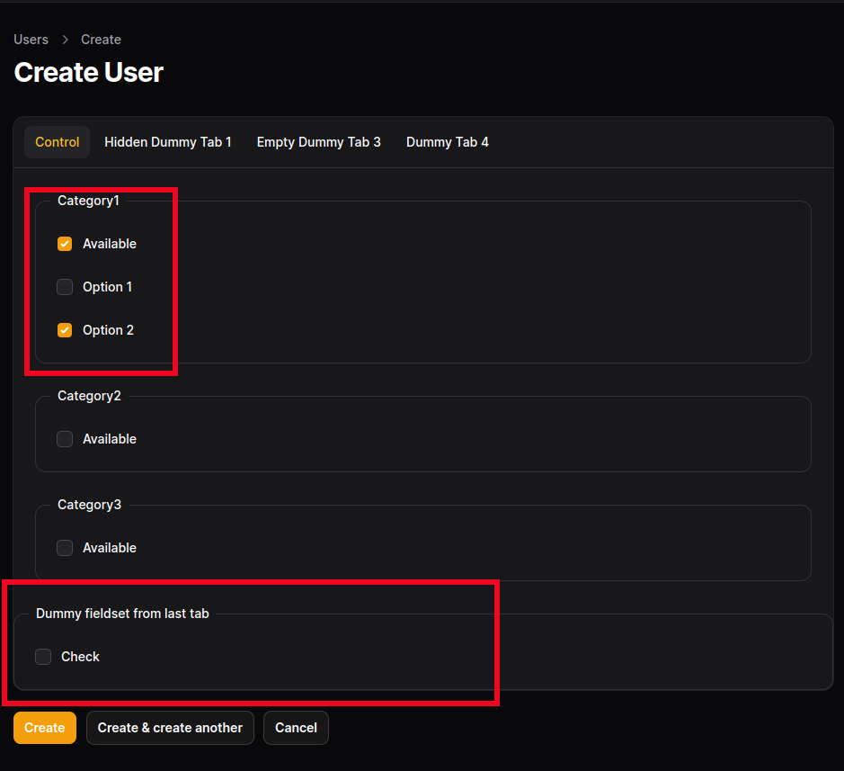
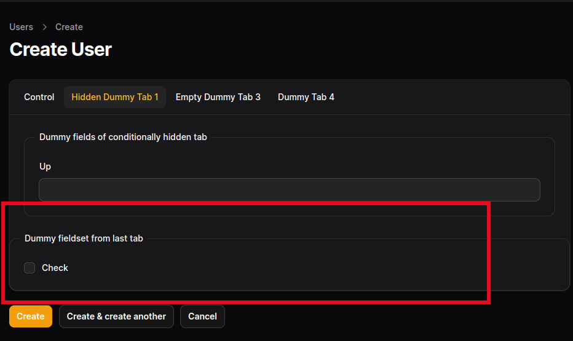
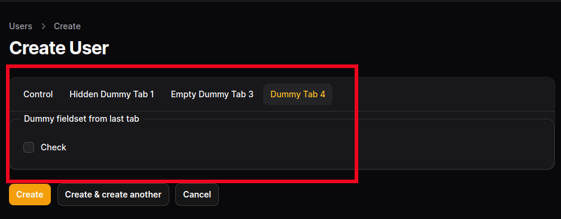
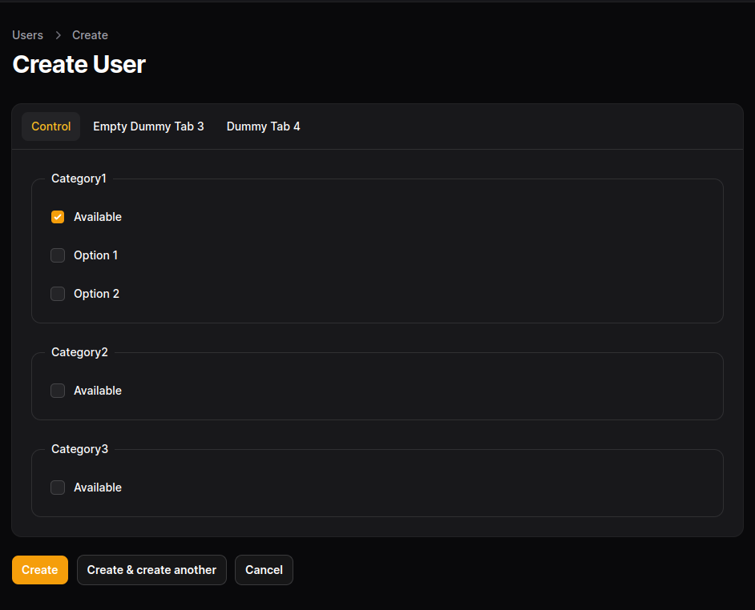
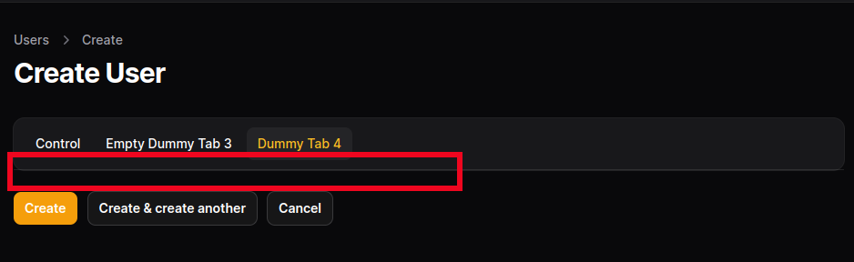

## Project Setup

- `git clone git@github.com:mariusaustr/filamentphp-tabs-bug.git`
- `cp .env.example .env`
- `composer install`
- `php artisan key:generate`
- `php artisan migrate --seed`
- `php artisan serve`

## Bug Description

I have created a sample project where Filament Form Tabs do not seem to behave as expected. Wrong Tab content is shown or content goes missing when `live()` and `hidden()` form elements are utilised. The form is built in `App\Filament\UserResource::form()`.

## Steps to reproduce

- Navigate to `http://localhost:8000/admin` (or any other URL if php artisan serve provides different port)
- Login using credentials: `test@example.com` + `password` (Defined in `DatabaseSeeder`)
- Navigate to `Users` section & press `New User` to get redirected to `Create User` form.
- You will see multiple tabs, where form elements are displayed as expected.
- In `Control` Tab check any of `Available` checkboxes & then check `Option 2` of the same category
- [BUG] Confirm content fropm last tab is shown in the bottom of every tab. In the last tab it looks like padding disappears - This should not happen
- 
- 
- 
- [BUG] If you uncheck the `Option 2` checkbox you have just checked, the content from the last tab disappears completely from all tabs, even the last one - This should not happen either
- 
- 

